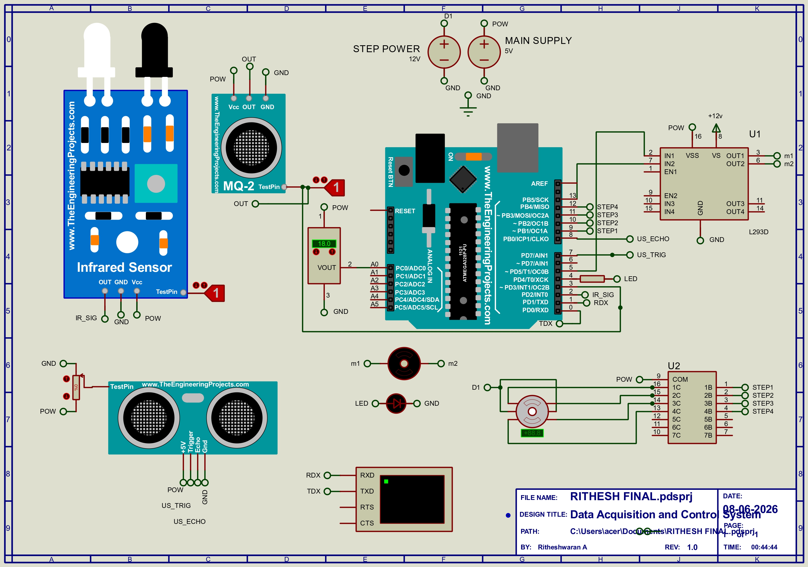
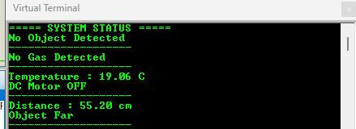
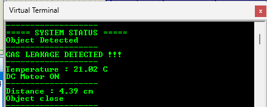

# Embedded Multi-Sensor Monitoring and Control System


## Project Overview

The **Embedded Multi-Sensor Monitoring and Control System** is a real-time data acquisition and automation project developed using **Arduino Uno**.

The system continuously monitors environmental conditions using multiple sensors and automatically controls actuators based on predefined threshold values.

This project demonstrates:

* Real-time sensor interfacing
* Embedded monitoring
* Automated control systems
* Data acquisition techniques
* Industrial automation concepts
* Decision-based actuator control

---

## Problem Statement

Design and develop a microcontroller-based Data Acquisition and Control System capable of acquiring real-time data from multiple sensors and automatically controlling output devices according to predefined conditions.

---

## System Architecture

```text
                 +------------------+
                 |   Arduino Uno    |
                 +------------------+
                          |
      -------------------------------------------------
      |            |             |                   |
      |            |             |                   |
   IR Sensor    MQ-2 Gas     LM35 Sensor      Ultrasonic
                Sensor                         Sensor
      |            |             |                   |
      |            |             |                   |
 Object       Gas Leakage   Temperature        Distance
Detection      Detection      Monitoring      Measurement
      |            |             |                   |
      -------------------------------------------------
                          |
          --------------------------------
          |              |               |
          |              |               |
        LED          DC Motor      Stepper Motor
      Alert           Control        Automation
```

---

## Features

* Real-time sensor monitoring
* Object detection using IR sensor
* Gas leakage detection with LED alert
* Temperature-based DC motor control
* Ultrasonic distance measurement
* Automatic stepper motor operation
* Continuous Serial Monitor output
* Threshold-based automation
* Embedded control system implementation

---

## Components Used

| Component                 | Purpose                   |
| ------------------------- | ------------------------- |
| Arduino Uno               | Main Controller           |
| IR Sensor                 | Object Detection          |
| MQ-2 Gas Sensor           | Gas Leakage Detection     |
| LM35 Temperature Sensor   | Temperature Monitoring    |
| HC-SR04 Ultrasonic Sensor | Distance Measurement      |
| L293D Motor Driver        | DC Motor Control          |
| ULN2003 Driver            | Stepper Motor Interface   |
| DC Motor                  | Automated Cooling/Control |
| Stepper Motor             | Distance-Based Motion     |
| LED                       | Warning Indicator         |

---

## Pin Configuration

| Arduino Pin | Connected Device        |
| ----------- | ----------------------- |
| D2          | IR Sensor               |
| D3          | MQ-2 Gas Sensor         |
| D4          | LED                     |
| D5          | DC Motor Input 1        |
| D13         | DC Motor Input 2        |
| D7          | Ultrasonic Trigger      |
| D8          | Ultrasonic Echo         |
| D9          | Stepper Motor Coil A    |
| D10         | Stepper Motor Coil B    |
| D11         | Stepper Motor Coil C    |
| D12         | Stepper Motor Coil D    |
| A0          | LM35 Temperature Sensor |

---

## Functional Description

### 1. IR Sensor

Detects nearby objects.

**Condition**

* HIGH → Object Detected
* LOW → No Object Detected

---

### 2. Gas Sensor and Alert System

Monitors gas leakage conditions.

**Condition**

* Gas Detected → LED blinks continuously
* No Gas → LED remains OFF

---

### 3. Temperature Monitoring and DC Motor Control

The LM35 sensor continuously measures ambient temperature.

**Threshold Temperature:** 20°C

**Condition**

* Temperature ≥ 20°C → DC Motor ON
* Temperature < 20°C → DC Motor OFF

---

### 4. Ultrasonic Sensor and Stepper Motor Control

Measures distance between sensor and object.

**Threshold Distance:** 15 cm

**Condition**

* Distance < 15 cm

  * Stepper rotates clockwise
  * Stepper rotates anticlockwise

* Distance ≥ 15 cm

  * Stepper remains stopped

---

## System Workflow

```text
Start
  |
Read Sensor Data
  |
Process Sensor Values
  |
Compare with Thresholds
  |
Execute Control Actions
  |
Display Status on Serial Monitor
  |
Repeat Continuously
```

---

## Circuit Diagram

### Proteus Simulation Circuit



---

## Project Demonstration

### Google Drive Project Files

Project Resources:

https://drive.google.com/drive/u/0/folders/1DKsZYU_bfopb9j0VWOTwYdVp9OY8z6Tq

---

## Serial Monitor Output

### Output 1



### Output 2



---

## Repository Structure

```text
Embedded-Multi-Sensor-Monitoring-and-Control-Systems
│
├── Circuit
│   ├── circuit_diagram.jpg
│   └── wiring_diagram.PDF
│
├── Model
│   └── Data Acquisition and Control System model.pdsprj
│
├── Output
│   ├── serial_output1.png
│   └── serial_output2.png
│
├── code
│   └── data_code.ino
│
├── README.md
└── LICENSE
```

---

## Applications

* Industrial Monitoring Systems
* Smart Factory Automation
* Environmental Monitoring
* Safety Alert Systems
* Sensor-Based Automation
* Embedded Control Systems
* Academic Embedded Projects

---

## Future Enhancements

* IoT Integration
* Wi-Fi Connectivity
* Cloud Data Logging
* Mobile Application Interface
* LCD/OLED Display
* Remote Monitoring Dashboard
* Data Analytics Integration

---

## Technologies Used

* Arduino IDE
* Embedded C/C++
* Proteus Professional
* Sensor Interfacing
* Serial Communication
* Embedded Automation

---

## Learning Outcomes

Through this project, the following concepts were implemented:

* Sensor Interfacing
* Real-Time Data Acquisition
* Embedded System Design
* Actuator Control
* Automation Logic
* Threshold-Based Decision Making
* Industrial Monitoring Concepts

---

## Author

**Ritheshwaran A**

B.E. Electronics and Communication Engineering

College of Engineering Guindy (CEG)

Anna University

GitHub: https://github.com/LinkwithRithesh

---

## License

This project is licensed under the MIT License.
